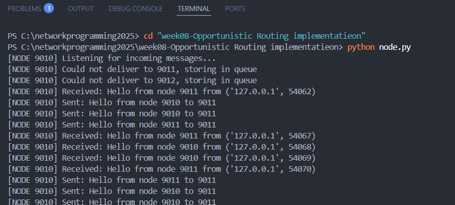

# Week 8: Opportunistic Routing (การหาเส้นทางแบบฉวยโอกาส)

## 📌 Overview (ภาพรวมของโปรเจกต์)
Week 8 เป็นการจำลองการทำงานของเครือข่ายแบบ **Opportunistic Routing** ซึ่งออกแบบมาสำหรับสภาพแวดล้อมที่อุปกรณ์ไม่ได้เชื่อมต่อกันตลอดเวลา (Delay-Tolerant Networks - DTN) เช่น เครือข่ายเซ็นเซอร์ติดตามสัตว์ป่า (Wildlife Tracking) หรือระบบสื่อสารในพื้นที่ประสบภัยพิบัติ

แทนที่จะคาดหวังการเชื่อมต่อที่สมบูรณ์แบบ 100% ระบบนี้จะใช้แนวคิด **"Store, Wait, and Forward"** โดยอาศัยจังหวะที่โหนด (Node) เคลื่อนที่มาพบกัน (Encounter) แล้วพิจารณาจาก "ตารางความน่าจะเป็น" (Delivery Probability Table) เพื่อตัดสินใจส่งข้อมูล

## 🛠️ Key Concepts (หลักการทำงานหลัก)
- **Delivery Probability Table:** แต่ละโหนดจะมีตารางประเมินความน่าจะเป็น หากความน่าจะเป็นในการส่งสำเร็จสูงกว่าเกณฑ์ (Threshold > 0.5) จึงจะทำการส่ง
- **Message Queueing:** หากปลายทางยังไม่พร้อมรับข้อมูล โหนดจะทำการเก็บข้อความนั้นไว้ในคิว (Store) แทนการทิ้งข้อมูล (Drop packet)
- **Encounter-Based Forwarding:** ระบบจะคอยตรวจสอบแบบ Background Process เมื่อพบว่าโหนดเป้าหมายกลับมาออนไลน์ จะทำการดึงข้อมูลจากคิวและส่งออกไปทันที (Forward)

## 🚀 How to Run (วิธีทดสอบระบบ)
1. เปิด Terminal 2 หน้าต่าง เพื่อจำลอง Node 2 ตัว (เช่น Port `9010` และ `9011`)
2. รัน Node ตัวแรกด้วยคำสั่ง `python node.py` (ระบบจะพยายามส่งข้อความ แต่จะเก็บเข้าคิวไว้ก่อนเนื่องจากปลายทางยังไม่เปิด)
3. สลับไปตั้งค่า `BASE_PORT = 9011` ในไฟล์ `config.py` และรันใน Terminal ที่ 2
4. สังเกตการทำงานแบบ Opportunistic เมื่อ Node ทั้งสองเจอกัน

## 📊 Expected Output & Demonstration
ภาพด้านล่างแสดงให้เห็นถึงกลไกการทำงานของ Opportunistic Routing อย่างสมบูรณ์:

> **📸 Screenshot:**
> 

**คำอธิบายจากภาพผลลัพธ์:**
1. **`Could not deliver..., storing in queue`**: Node 9010 พยายามส่งข้อความหา 9011 แต่ปลายทางออฟไลน์อยู่ ระบบจึงทำการจัดเก็บข้อความลง Message Queue อย่างปลอดภัย
2. **`Received: Hello from node 9011...`**: เป็นจังหวะ Encounter  เมื่อ Node 9011 ออนไลน์และส่งสัญญาณทักทายเข้ามา
3. **`Sent: Hello from node 9010 to 9011`**: ทันทีที่รับรู้ว่าปลายทางพร้อม Node 9010 ได้ดึงข้อความที่ค้างอยู่ในคิวส่งออกไปหาเป้าหมายได้สำเร็จตามหลักการ Opportunistic Forwarding