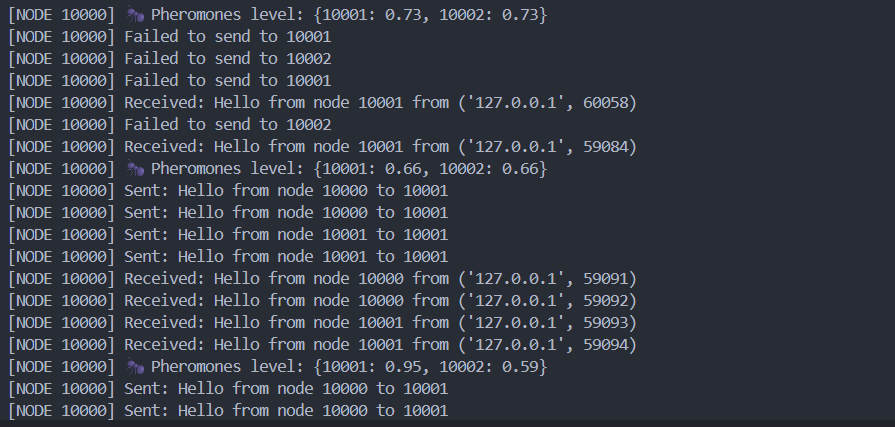

# Week 9: Bio-Inspired Networking (เครือข่ายเลียนแบบชีวภาพ)

## 📌 Overview (ภาพรวมของโปรเจกต์)
Week 9 นี้จำลองการหาเส้นทางข้อมูลแบบ **Bio-Inspired Routing** โดยใช้แนวคิด **Ant Colony Optimization (ACO)** ซึ่งเลียนแบบพฤติกรรมการหาอาหารของมดตามธรรมชาติ เหมาะสำหรับเครือข่ายที่มีการเปลี่ยนแปลงสูงหรือมีโหนดที่เปิดๆ ปิดๆ (Dynamic Topology)

ระบบจะไม่พึ่งพาตารางเส้นทางแบบตายตัว (Static Routing) แต่จะใช้กลไกการให้รางวัล (Reinforcement) และการลืม (Decay) ผ่านตัวแปรที่เรียกว่า **"ฟีโรโมน (Pheromone)"** เพื่อให้เครือข่ายสามารถปรับตัวหาเส้นทางที่ดีที่สุดได้ด้วยตัวเอง (Self-Optimizing System)

## 🛠️ Key Concepts (กลไกการทำงานหลัก)
- **Pheromone Table:** ตารางเก็บค่าความน่าเชื่อถือของโหนดเพื่อนบ้าน (เริ่มต้นที่ 1.0) หากค่านี้ต่ำกว่าเกณฑ์ (`FORWARD_THRESHOLD` = 0.2) จะหยุดส่งข้อมูลไปทางนั้น
- **Reinforcement (การเสริมแรง):** เมื่อฝากส่งข้อความสำเร็จ โหนดจะทิ้งฟีโรโมนเพิ่มให้โหนดปลายทาง (`REINFORCEMENT` = +0.1) ทำให้เส้นทางนั้นน่าดึงดูดมากขึ้นในรอบถัดไป
- **Decay (การระเหย):** เมื่อเวลาผ่านไป กลิ่นฟีโรโมนในระบบจะค่อยๆ จางลง (`DECAY_FACTOR` = 0.9 หรือลดลง 10%) เพื่อป้องกันไม่ให้โหนดดื้อดึงส่งข้อมูลไปหาเพื่อนที่ออฟไลน์ไปแล้วหรือเส้นทางที่ขาด

## 🚀 How to Run (วิธีทดสอบระบบ)
1. เปิด Terminal 2 หน้าต่าง เพื่อจำลอง Node (เช่น Port `10000` และ `10001`)
2. รันโหนดตัวแรกด้วยคำสั่ง `python node.py` (ระบบจะพยายามส่ง แต่เมื่อไม่สำเร็จ ค่าฟีโรโมนจะค่อยๆ ระเหยลดลง)
3. สลับไปตั้งค่า `BASE_PORT = 10001` ในไฟล์ `config.py` แล้วรันใน Terminal ที่ 2
4. สังเกตตาราง Pheromone Table ที่อัปเดตแบบ Real-time เมื่อโหนดพบกันและส่งข้อมูลสำเร็จ

## 📊 Expected Output & Demonstration
ภาพด้านล่างแสดงการปรับตัวของระบบ Routing ตามหลัก Reinforcement Learning อย่างชัดเจน:

> **📸 Screenshot:**
> 

**วิเคราะห์ผลลัพธ์จากภาพ:**
1. **`Pheromones level: {10001: 0.66, 10002: 0.66}`**: กลไก **Decay** ทำงาน เนื่องจากยังไม่สามารถติดต่อใครได้ ค่าฟีโรโมนจึงค่อยๆ ระเหยลดลงจาก 1.0
2. **`Sent: Hello... to 10001`**: ระบบตรวจพบโหนด 10001 ออนไลน์และส่งข้อความที่ค้างอยู่ในคิวสำเร็จ
3. **`Pheromones level: {10001: 0.95, 10002: 0.59}`**: กลไก **Reinforcement** ทำงานอย่างสมบูรณ์แบบ! โหนด 10001 ได้รับรางวัลจากการส่งสำเร็จ ค่าฟีโรโมนจึงพุ่งกลับขึ้นมาที่ `0.95` ในขณะที่โหนด 10002 ที่ติดต่อไม่ได้ ค่าฟีโรโมนยังคงระเหยลดลงไปอยู่ที่ `0.59` เครือข่ายจึงเรียนรู้ที่จะเทน้ำหนักการส่งข้อมูลไปที่ 10001 โดยอัตโนมัติ